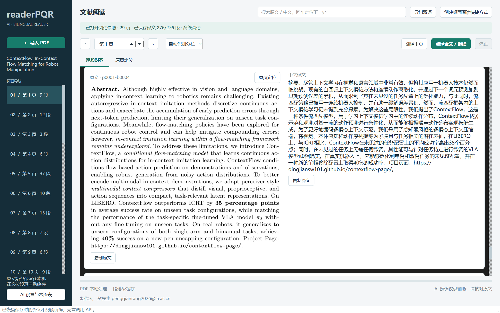
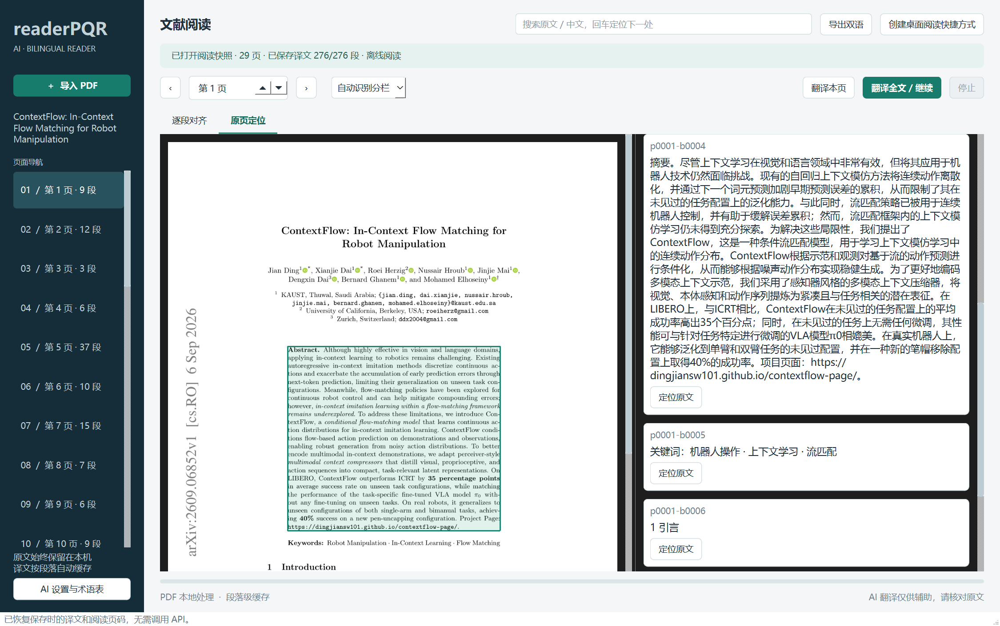

# readerPQR

制作人：彭先生 pengqianrang2026@ia.ac.cn

面向 **Windows 11 x64** 的 AI 文献阅读器。导入 PDF，在本地提取文字与段落坐标，再通过你配置的 AI 接口生成 **逐页、逐段对齐的简体中文译文**。

> 当前版本：0.1.0。需要自备模型 API，或启动兼容 Chat Completions 的本机模型服务。没有内置付费密钥。扫描 PDF 暂不内置 OCR；本版本不是保持原版式的整本中文 PDF 重排器。

## 看看实际阅读效果

**左边核对英文，右边阅读中文；需要上下文时，一键回到原页。**

以下为 readerPQR 打开 *ContextFlow: In-Context Flow Matching for Robot Manipulation* 后的真实界面截图。示例已完成 29 页、276 个文本段落的翻译，并保存为离线阅读快照。

### 逐段对照，阅读不串行

原文截图与对应中文放在同一行，共用滚动区域。原文字体、公式和引用保留在截图中，译文支持复制。



### 回到原页，随时核对上下文

点击「原页定位」，即可查看 PDF 原页并高亮对应段落。读完后点击「创建桌面阅读快捷方式」，下次直接恢复 PDF、已保存译文和阅读页码，无需再次调用 API。



示例论文：[ContextFlow（arXiv:2609.06852）](https://arxiv.org/abs/2609.06852)。论文内容归原作者所有；截图中的中文为 AI 辅助译文，请以原文为准。图片展示本地阅读效果，不代表论文作者对本项目的背书。

## 使用方式

### 便携版：无需安装 Python

在本仓库 **Actions → Windows desktop build → 最新成功的运行 → Artifacts** 下载 `readerPQR-Windows-x64`。解压整个压缩包，打开 `readerPQR.exe`。**不要单独移动 exe，必须保留 `_internal` 目录。** 构建尚未成功时不会生成该便携包。

便携包未做商业代码签名。请核对仓库、提交与构建记录；不要为了运行未知文件而关闭系统安全防护。

### 源码版：安装 Python 3.12 x64 后启动

下载本仓库源码 ZIP 并解压，然后双击 `start_windows.bat`。第一次运行会创建项目独立虚拟环境并安装依赖。也可以在项目目录运行：

```powershell
py -3.12 -m venv .venv
.\.venv\Scripts\python.exe -m pip install -r requirements.txt
.\.venv\Scripts\python.exe -m readerpqr
```

完整操作步骤见 [Windows 中文指南](docs/WINDOWS_GUIDE.md)。

## 第一次翻译

### 保存桌面阅读入口

导入 PDF 并完成所需翻译后，点击右上角 **创建桌面阅读快捷方式**。
程序会在本地保存 PDF 副本、当前译文和当前页码，并创建桌面快捷方式。
以后双击即可离线恢复阅读，不需要 API 密钥，也不依赖原 PDF 所在的位置。
快照位于 Windows 文档文件夹的 `readerPQR/reading-snapshots` 文件夹，请保留该目录和程序安装位置。
快捷方式保存的是创建当时的译文；后续翻译更新后需重新创建。
需要密码的 PDF 暂不支持创建阅读快捷方式。

打开左下角 **AI 设置与术语表**，填写接口、模型和 API Key，点击 **测试连接**。确认地址可信后勾选文字发送许可，保存设置，再导入 PDF。

默认提供智谱配置：

```text
API Base URL: https://open.bigmodel.cn/api/paas/v4
Model: glm-4.7-flash
高级参数: {"thinking":{"type":"disabled"}}
```

模型名称、可用性与计费以服务商为准。通用接口请选择“通用 Chat Completions”，填写自己的 Base URL 与模型，先把高级参数设为 `{}`。API 地址也可以包含完整的 `/chat/completions` 后缀。

“导入 PDF 后自动翻译全文”默认启用，但只有正确配置密钥并授权当前地址后才会发送文字。可以取消自动翻译，先按“翻译本页”控制调用量。

## 功能与边界

### 论文总结

导入 PDF 后点击左侧 **论文总结**，再点击 **生成论文总结**，使用已配置的 API 对整篇论文生成五部分总结：**论文议题、论文重点、实验结果、结论、对本人的启示**。

可填写个人研究方向、学习阶段与关注点，让启示包含具体行动与验证方式；留空则按一般读者生成。该背景随论文一起发送给已授权的 API。总结要求对论文事实引用 PDF 页码，并区分作者结论和 AI 建议；缺失的实验或数字会要求明确说明。

支持流式显示、停止、复制总结，以及生成时继续操作首页。总结与问答记录分开，只在本次运行中保留；切换论文会停止旧总结并清空记录。沿用问答的总时限和单次提交机制，不会因失败自动重发。

### 论文问答

导入 PDF 后点击左侧 **论文问答**，输入问题即可使用「AI 设置与术语表」中已配置的接口、模型和密钥回答。无需先翻译论文。

问答使用独立窗口，打开后仍可在主界面翻页、核对原文或修改设置；新设置从下一次提问生效。切换到另一篇论文时会停止并关闭旧论文问答，避免上下文混淆。

- 点击 **添加附件** 可多选 PDF、PNG/JPG图片、TXT、Markdown（.md）或 CSV，再输入问题发送。支持移除选中附件、同一路径去重；最多5个，每个不超过10 MB。论文与附件提取文字合计不超过120,000字符，超限会提示，不会悄悄截断。
- 附件在本机准备，仅在点击发送时交给已配置且授权的 API：文本发送文字；PNG/JPG发送图像；PDF扫描页、含图片/绘图的页面或文字稀少页发送页面图像，同时保留可提取文字。图像直接交给模型识别，无需另配OCR服务；接口及模型须支持图像输入。回答要求使用如 `[附件1 文件名 第2页]` 的引用区分来源，不发送本地路径。加密或损坏文件会提示错误。
- 单次最多发送20张图片/图像页，图像最长边不超过1600像素，编码后的图像数据合计不超过20 MB；超限要求拆分，不会默默遗漏页面。小字或模糊图片可能识别不准确，建议提供清晰局部截图。
- 附件列表仅保留在当前问答窗口内，会随每次追问发送；关闭窗口或切换论文后需重新添加。移除附件后不会再发送其原文，但先前问答记录可能保留引用，必要时可清空对话。
- 可选择 **整篇论文** 或 **指定页**，支持最近两轮对话的连续追问、停止回答、复制回答和清空对话。
- 默认开启 **流式显示**，收到回答文字就显示，无需等待整段生成完。单次请求使用界面设置的总时限（默认 300 秒），没有额外的 90 秒限制；首段文字在总时限内等待，开始输出后连续 60 秒没有新增文字会提示中断。
- 每次点击只提交一次请求；超时、断线、限流或服务异常均不会自动重发，避免重复生成和潜在重复费用。中断时保留已接收文字并标注“未完成”，可复制，但不加入后续问答上下文。若接口不支持流式，可取消勾选后手动重新发送。
- GPT-5 系列问答默认使用 `reasoning_effort: low` 和 5,000 token 输出上限，减少长时间等待；高级 JSON 中显式设置的推理强度、输出上限优先。默认回答简明扼要，需要深入分析时可在问题中说明。全文原文仍完整发送，不通过省略论文内容提速。
- 点击发送时会发送问题、所选范围的论文原文和最近两轮问答；可能产生模型 API 费用，仍需事先授权当前接口。
- 回答会要求引用 PDF 页序（如 `[第3页]`），引用由模型生成，请核对原文。主论文默认使用提取文字；需要识别图片、图表或扫描页时可添加为附件，部分细节仍可能识别不准。
- 全文超过 120,000 字符时会提示改为指定页，不会悄悄截断。模型自身的上下文上限可能更低。
- 对话只保留在本次程序运行中，切换到另一篇论文后清空，不包含在阅读快照中。需要保存时可复制回答。

| 功能 | 实现方式 |
| --- | --- |
| 逐段对齐 | 原文截图和中文共享同一行，行高随译文增长，统一滚动，不靠两个滚动条百分比凑齐 |
| 原页定位 | 完整 PDF 页面保留图表与公式；点击文字区域或译文的定位按钮，相互定位 |
| 双栏论文 | 使用坐标启发式排序；可手动切换单栏或双栏。复杂表格、多栏和浮动框可能仍需核对 |
| 自动翻译 | 后台分批处理；支持翻译本页、全文、停止、继续；正文不会阻塞界面等待 API |
| 防止错位 | 严格校验段落 ID、重复项、空译文和缺失项；格式不合格的结果不写入缓存 |
| 公式与引用 | 原文截图完整保留；可识别的公式块不翻译；文字内的数字引用与部分公式用占位符保护 |
| 学术术语 | 设置中编辑术语表，默认含机器人学习常见词汇；修改后使用独立缓存 |
| 缓存恢复 | SQLite 按 PDF 哈希、模型、服务地址、术语表和提示词版本隔离；已完成部分无需再次付费请求 |
| 导出 | 离线双语 HTML 和带坐标的 JSON。HTML 可在浏览器打印为 PDF，但不重建原 PDF 的图片与公式排版 |
| 密钥保护 | Windows 可选 DPAPI 加密保存；其他平台仅内存使用密钥 |

**不保证所有 PDF 都能正确分段，也不保证模型翻译无误。** 文本编码损坏、扫描文档、复杂数学排版和表格是主要限制。图中嵌入文字不会自动翻译。参考文献与作者信息应核对原文。

## 隐私与安全

PDF 文件和渲染图片留在本地；调用 API 时发送段落文字、术语表、固定翻译提示和所选参数。应用没有遥测、文件上传服务或嵌入的网页脚本。文本内容被当作待翻译材料，不会作为工具调用指令执行。

设置与缓存位置：`%LOCALAPPDATA%\readerPQR`。密钥不进入日志或缓存索引，DPAPI 密文绑定当前 Windows 用户。**译文本身是本地未加密缓存**，请用操作系统账户和磁盘权限保护敏感文献。不保存 PDF 打开密码。

## 开发与打包

```powershell
.\.venv\Scripts\python.exe -m pip install -r requirements-dev.txt
.\.venv\Scripts\python.exe -m pytest -q
.\.venv\Scripts\python.exe -m readerpqr --self-test --output smoke
.\.venv\Scripts\python.exe scripts\build_windows.py
```

也可以双击 `build_windows.bat`。Windows 包必须在 Windows 上构建，不能把 Linux 的 PyInstaller 产物当成 exe。GitHub Actions 使用 Python 3.12 x64，运行离线单元测试、源代码 GUI 冒烟测试、打包后的 exe 冒烟测试，并提供测试截图和精确源码快照。

`--self-test` 使用程序生成的合成 PDF 和明确标注的离线占位文本，不调用真实模型，不证明模型翻译质量。真实 API 验收需用户填写密钥后完成。

## 项目结构

```text
readerpqr/pdf_engine.py   本地解析、阅读顺序、页面/段落渲染
readerpqr/translate.py    API、响应校验、可取消请求、缓存恢复
readerpqr/storage.py      设置、DPAPI、SQLite
readerpqr/ui.py           双语桌面界面、搜索、原文定位
readerpqr/dialogs.py      模型设置与连接测试
readerpqr/export.py       HTML / JSON 导出
readerpqr/smoke.py        离线合成文献与界面检查
scripts/build_windows.py Windows 打包及第三方许可收集
```

## 许可与技术资料

项目按 AGPL-3.0-only 发布；依赖的许可信息见 [THIRD_PARTY_NOTICES.md](THIRD_PARTY_NOTICES.md)。打包版附带对应源代码。技术资料见 [架构与验收说明](docs/ARCHITECTURE.md)。

## 自愿打赏

程序左下角的 **支持作者 / 自愿打赏** 可打开微信收款码，也可保存原图。该页面仅在点击后打开，不影响阅读或翻译。

如果 readerPQR 帮你更轻松地阅读论文，欢迎通过微信打赏支持作者维护项目。感谢每一份支持！

打赏完全自愿，不是软件使用费，不影响按开源许可证使用本项目，也不包含模型 API 额度或额外服务承诺。

<p align="center">
  
</p>

图片标注金额为 **¥0.50**，请在微信付款前核对实际金额与收款人。也欢迎通过 Star、反馈问题或贡献代码支持项目。
